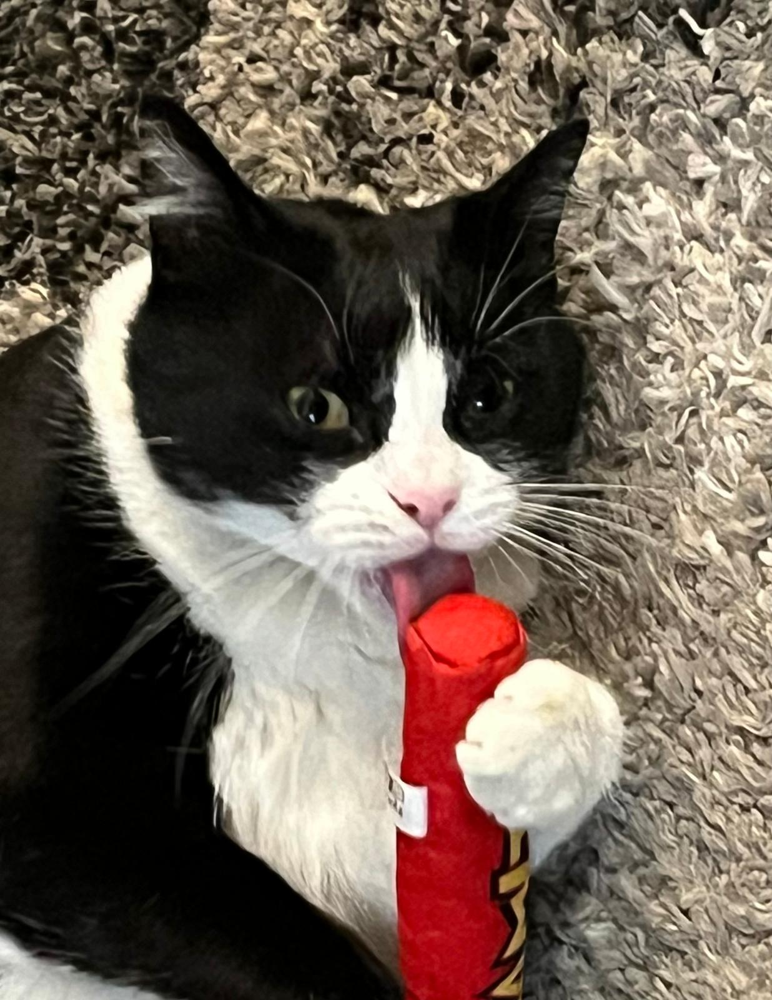
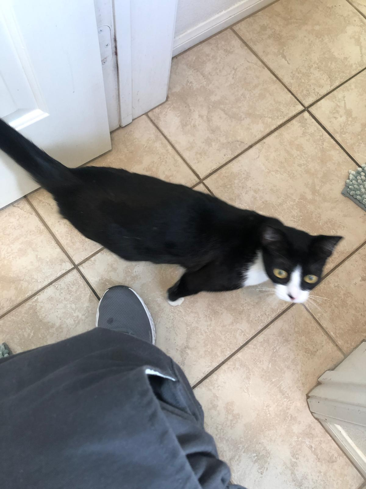
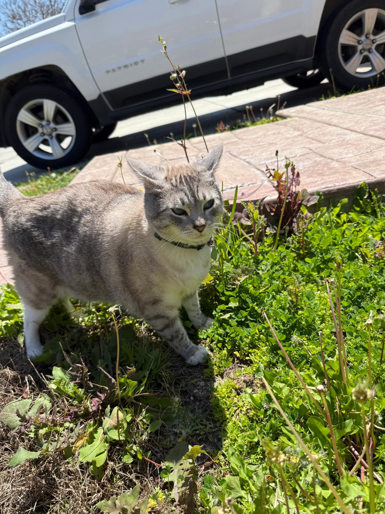

# Pablo Wells #

## About me ##
Hello, I am Pablo Wells. I am a Computer Science transfer student at UCSD. I transferred from **San Diego Mesa College**. If you've transferred from here, **let me know**. I'd love to meet you! 
At Mesa College, I was the VP of the Computer Science club. I helped organize club meetings and hackathon trips. I also took the my general education and most of my pre-reqs for the upper division courses.
Now at UCSD, I have participated in a few club events. I've helped in a project for VGDC's Project Forge. I also am doing undergraduate research in the CS Education department. 

## My favorite saying ##
> Time will pass anyway

Whenever I encounter a problem that makes me want to quit working and scroll on Tiktok, I say this to myself and it is typically enough for me to keep going at it. I do not know if this saying is credited to anybody.

## Coding Journey so far ##
Much like the person reading this, I began coding with this line of code: 
'''
print("Hello, World!)
'''
I first began coding in the summer leading to my senior year of highschool using a book called [*Automating the boring stuff with Python*] (https://automatetheboringstuff.com/). The book is available for free online and I recommend it. 

Since then, I've taken beginner classes in Java and C++ at Mesa College, as well as intermediate Java and Data Structures in C++. 

At UCSD, I've taken CSE 29, CSE 21, CSE 100, and CSE 101, which are pretty much all the pre-reqs to CSE 110.

I hope to keep learning about programming and building project on my own and with teammates.

## Cats ##
I have three cats. They are:

- Kitta
- Mina
- Indy

## Favorite Foods ##
1. Tacos de Tripa (Cow Intestine Tacos)
2. Camarones Costa Azul (Shrimp wrapped with bacon stuffed with cheese)
3. Pizza de adobada (Pizza with mexican-style pork)

## Goals Achieved ## 
- [x] Get a 4.0 at Mesa College
- [x] Transfer to UCSD
- [x] Conduct research
- [ ] Get an internship
- [ ] Maintain a > 3.5 GPA
- [ ] Get a CS-related career

[Go to Top](#pablo-wells).